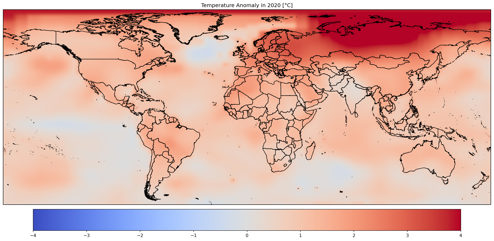

# Visualizing Climate Change Data with Python
Generating charts and animations for climate change data (GISTEMP v4), with the xarray and cartopy Python libraries.

### Towards Data Science Article:
[Visualizing Climate Change Data with Python](https://towardsdatascience.com/visualizing-climate-change-data-with-python-74ea5bac8756)

### Workflow explanation 
In this project I used the cartopy and xarray python libraries. Note that the cartopy library has a significant amount of dependencies, the easiest way to install it is through anaconda, where you will need to create a dedicated virtual environment that contains all the dependencies. As for the video ffmpeg formatting you will also need to install it with anacoda!
If in case you encounter any difficulties replicating this work feel free to reach out via mail: elwely30@gmail.com

